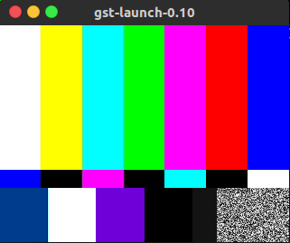

# gst-launch指令使用

* 测试(显示摄像头视频)
  * gst-launch-0.1Missing element: H.264 (Baseline Profile) decoder0 autovideosrc ! ffmpegcolorspace ! autovideosink
  * gst-launch-0.10 v4l2src ! ffmpegcolorspace ! autovideosink
  * gst-launch v4l2src ! xvimagesink
* 将摄像头视频比例设置为16：2
  * gst-launch v4l2src ! video/x-raw-yuv,width=640,height=480 ! aspectratiocrop aspect-ratio=16/2 ! ffmpegcolorspace ! xvimagesink
* 播放MP4文件
  * gst-launch-1.0 playbin uri="file:///home/zpq/bbb.mp4"
* gstreamer实现视频显示
  * gst-launch videotestsrc ! xvimagesink
  * 

* 输出到指定文件中
* 保存摄像头的视频为avi格式